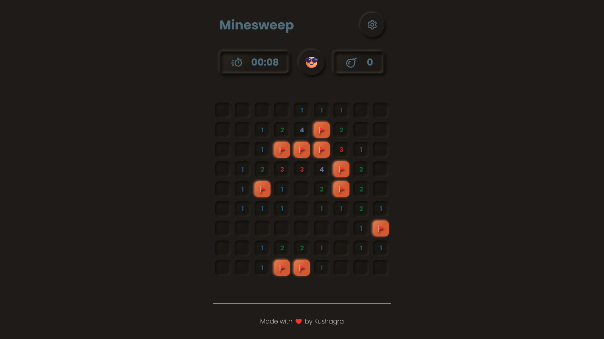

# Minesweep 💣

The classic game of  Minesweeper, made using Next.js and React




[Live on Vercel](https://minesweep-delta.vercel.app/)

------------

### Gameplay 🕹️

Each cell in the board has three possible states, 'uncovered', 'covered', or 'flagged'. The board is generated once you click on an empty tile to prevent guessing. A set number of Mines are scattered throughout the Cells randomly which can end your game. To win, the player must uncover all non-mine cells.


### Running Locally 💡

```bash
$ git clone https://github.com/Vynex/minesweep

$ cd minesweep
$ npm install

$ npm run dev
```


------------

Design based on [Neumorphism Minesweeper](https://dribbble.com/shots/9779756-Neumorphism-Minesweeper) by Ahmad Bahrori on Dribbble.

------------